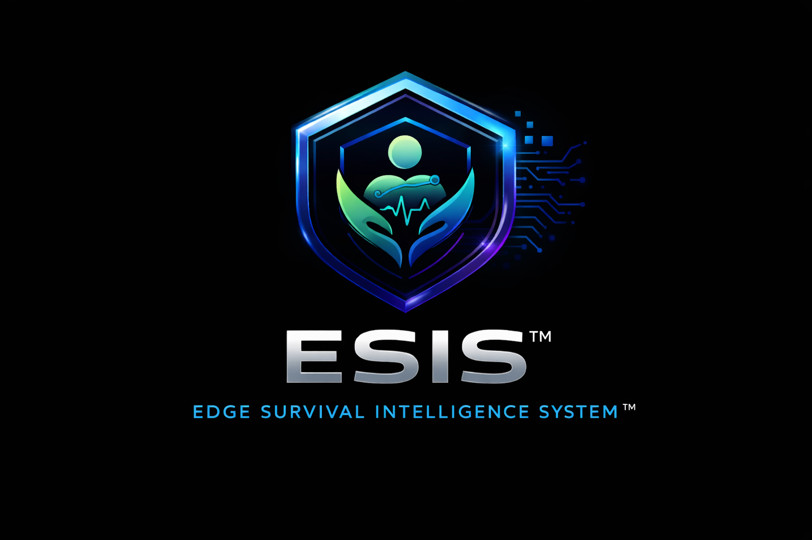

# ESIS — Edge Survival Intelligence System

<p align="center">
  
</p>


**Offline-first crisis navigation for people experiencing homelessness, powered by Gemma 4.**

> *"If someone with deep technical expertise and decades of experience cannot recover within the current system, then the system itself is fundamentally broken."*

---

## What It Does

ESIS converts fragmented, high-risk crisis situations into structured intervention pathways. Given a person's current state — symptoms, exposure conditions, document status, city, profile — it uses **Gemma 4** to generate an immediate action plan, a housing pathway, a full advocacy packet, and a real-time crisis ping that lets the surrounding community respond within minutes.

The system is designed to work **on a phone, on low bandwidth, in extreme constraint** — because that is where people actually need it.

---

## Links

- **Live Demo (HuggingFace Spaces):** *(link added after deployment)*
- **Kaggle Notebook (Gemma 4 + APK build):** *(link added after publication)*
- **Kaggle Competition:** https://www.kaggle.com/competitions/gemma-4-good-hackathon

---

## Why It Matters

Human-managed systems for allocating aid and housing are inconsistent, biased, and prone to critical failure. ESIS addresses this as a **decision-making problem**, not just a resource problem.

Failure modes that kill people every year:

| Failure Mode | What Happens | ESIS Response |
|---|---|---|
| Post-discharge instability | Hospital discharges to street with active infection | Advocacy packet + escalation pathway |
| Exposure risk | Freezing night, low battery, no shelter found | Offline routing + battery-aware fallback |
| Administrative collapse | Lost ID, broken referral chain, missed contacts | Document recovery sequence + packet |
| Enforcement displacement | Police sweep destroys shelter, belongings, relationships | Accountability log + legal aid routing |

---

## System Architecture


ESIS operates as a closed-loop decision system:

**State → Risk → Action → Outcome → Update**

- **Intake layer** — normalizes fragmented input into a structured case
- **Triage layer** — scores medical, exposure, documentation, and enforcement risk deterministically
- **Live search layer** — Serper queries 211.org, findhelp.org, and city agency sites in real-time
- **Gemma 4 reasoning** — generates structured JSON: summary, 3-horizon actions, fallback plan, preservation list
- **Housing track layer** — assigns one of 9 pathways based on profile + city data
- **Packet layer** — produces a referral-ready advocacy packet (one-page summary, advocate script, referral handoff, action timeline, preservation checklist)
- **Crisis ping layer** — starts a local WiFi HTTP server; helpers nearby open the link and respond in real time

---

## Mathematical Framework

ESIS uses **4-state belief tracking** with chance-constrained optimization and CVaR risk control:

- **States**: `S = {stable, at_risk, crisis, post_incident}` — a 4-state Markov model
- **Belief state**: `b_t(s) = P(s_t | o_{1:t}, a_{1:t-1})` — partial observability over crisis state
- **Risk constraint**: `P(Harm_72h > τ) ≤ ε` — reject plans above harm threshold
- **CVaR**: minimize expected loss in the worst tail, not average-case outcomes
- **Enforcement dimension**: police contact is scored as a 4th independent risk axis alongside medical, exposure, and documentation risk


---

## Platform Overview

ESIS ships on two platforms. Both use the same Gemma 4 engine.

| Platform | Use Case | Build |
|---|---|---|
| Android APK | Field use — outreach workers, individuals in crisis | EAS / Kaggle notebook |
| Streamlit Web | Case manager desk, demos, evaluation | HuggingFace Spaces |

---

# Android App — V2 Feature Guide

## Installation

1. **Install the APK** — Download `esis-v2-debug.apk` from the release page or build it yourself (see Kaggle notebook)
2. **Allow installation from unknown sources** — Android Settings → Security → Install Unknown Apps → allow your browser/file manager
3. **Open ESIS** — The app launches directly into the token setup screen

---

## Feature 1 — HuggingFace Token Gate

**What it does:** On first launch, ESIS requires a HuggingFace API token before anything else can be used. There is no skip button and no fallback. Without a valid token, the app does not generate plans.

**Why:** Gemma 4 is served from HuggingFace's Inference API. The token authenticates your request. Without it, you would only get a static, non-AI response — which defeats the purpose.

**How to get a token:**
1. Go to https://huggingface.co/settings/tokens
2. Click "New token" → Access type: Read → Create
3. Copy the token (starts with `hf_`)
4. Paste it into the ESIS token setup screen
5. Tap "Verify & Continue" — ESIS calls `/api/whoami` to confirm it works

The token is stored only on your device. It is never sent anywhere except HuggingFace.

---

## Feature 2 — Gemma 4 AI Case Analysis

**What it does:** After you fill in a case and tap "Analyze," ESIS sends the full case context to Gemma 4 (`google/gemma-4-27b-it`) via the HuggingFace chat completions API and returns a structured action plan.

**What Gemma receives:**
- City name, crisis line, legal aid contact, coordinated entry contact
- Live service search results from 211.org and findhelp.org (if Serper key is set)
- Case flags: medical pain, exposure risk, shelter status, ID status, discharge, displacement
- Risk scores across all 4 dimensions
- Housing track assignment
- Person profile: disability, employment, age, substance use, months homeless

**What Gemma returns:**
- `summary` — 2-sentence situation overview
- `immediateActions` — 0–2h critical actions (Horizon 1)
- `stabilizationActions` — next 24h (Horizon 2)
- `recoveryActions` — days to weeks (Horizon 3)
- `topActions` — used when no immediate crisis
- `fallbackPlan` — what to do if primary plan fails
- `whatToPreserve` — documents, belongings, relationships to protect now

If the API call fails for any reason (bad token, network, quota), ESIS shows an error and offers to open Settings. There is no silent fallback.

---

## Feature 3 — Multi-City Support

**What it does:** ESIS has built-in data for 6 cities. When you select a city, Gemma's prompt is automatically populated with that city's specific resources, and the housing track programs reflect local availability.

**Supported cities:**
| City | Crisis Line | Coordinated Entry | Legal Aid |
|---|---|---|---|
| Denver, CO | 844-493-8255 | 303-595-1538 | Colorado Legal Services |
| San Francisco, CA | 415-781-0500 | 415-255-0643 | Bay Area Legal Aid |
| Los Angeles, CA | 211 | 213-225-8431 | Inner City Law Center |
| New York City, NY | 311 | 311 | Legal Aid Society NYC |
| Miami, FL | 211 | 305-375-1874 | Community Legal Services |
| Dallas, TX | 211 | 214-461-0300 | Legal Aid of NW Texas |

Select your city using the chip picker at the top of the case input screen. The selection affects the Gemma prompt, housing track programs, and live service search location.

---

## Feature 4 — Live 211 Service Search (Serper)

**What it does:** Before calling Gemma, ESIS uses the Serper API to search Google for real, current services in your city that match the case's risk domains. Results from trusted sources (211.org, findhelp.org, city agency sites) are injected directly into Gemma's prompt.

**Why this matters:** Gemma's training data has a knowledge cutoff. Local shelter availability, program waitlists, and crisis line hours change constantly. Live search gives Gemma current information to work with.

**Setup:** Go to Settings, paste your Serper API key. Free at serper.dev — 2,500 searches/month on the free tier. If no key is set, ESIS skips the search and Gemma works from its training data only.

**Trusted sources searched:** 211.org, findhelp.org, lahsa.org, 311.nyc.gov, sfhsh.org, miamidade.gov, dallascityhall.com, and state/city health department sites.

---

## Feature 5 — Housing Track Assignment

**What it does:** Based on the person's profile and selected city, ESIS assigns one of 9 housing pathways with city-specific programs and immediate actions.

**The 9 tracks:**
| Track | Who It's For |
|---|---|
| Medical Respite | Active medical condition, needs treatment-stable housing first |
| Family Protection | Woman with minor children — highest shelter priority |
| Disability Housing | Documented disability — Section 8, disability housing waitlists |
| Treatment & Recovery | Substance use disorder — treatment-linked housing programs |
| Chronic Priority | Chronically homeless 1+ year — HUD chronic definition, VI-SPDAT priority |
| Senior Services | Age 50+ — senior housing programs, SSI/SSDI assistance |
| Working Stability | Currently employed — rapid rehousing, rental assistance |
| Professional Reentry | Professional background — employment-first, room/board programs |
| General Pathway | All others — shelter, coordinated entry, case manager |

Each track includes immediate actions specific to the assigned city's programs and contact numbers.

**View it:** From the Action Plan screen, tap "Housing Track" to see your assigned pathway, rationale, immediate actions, target programs, and a pre-written community ping message.

---

## Feature 6 — Advocacy Packet

**What it does:** Generates a complete documentation package that an advocate can hand to a service provider, hospital, or housing agency to accelerate access to help.

**Contents:**
- **One-Page Summary** — situation overview, risk level, immediate needs, contact info. Print-ready.
- **Advocate Script** — word-for-word language for phone calls or in-person meetings with service coordinators
- **Referral Handoff** — structured handoff document for passing the case to another advocate or agency
- **Action Timeline** — what needs to happen in 2 hours, 24 hours, and 72 hours
- **Preservation Checklist** — documents, items, and relationships to protect immediately

**View it:** From the Action Plan screen, tap "Advocacy Packet." Each section has a copy button to paste into an email, message, or document.

---

## Feature 7 — Real-Time SOS Ping

**What it does:** Turns the victim's phone into a live HTTP server. Anyone on the same WiFi network who opens the shared link (or scans the QR code) sees a real-time map showing the victim's GPS location, their needs, and a list of who has already responded to help.

**How it works — step by step:**
1. Open a case → tap "Action Plan" → tap "Real-Time SOS Ping"
2. Tap "Launch SOS Session" — ESIS requests location permission, gets your GPS coordinates, gets your WiFi IP address, and starts an HTTP server on port 8080
3. A QR code appears. Share the URL (`http://[your-ip]:8080`) or have someone scan the QR code
4. Anyone on the same WiFi who opens that link in any browser sees:
   - A live map (OpenStreetMap via Leaflet) with your location marked in red
   - Your listed needs and priority level
   - A list of helpers who have already responded
5. Helpers tap "I'm Coming to Help" — their name (optional) and location appear on your screen within seconds
6. Your GPS position updates every 5 seconds — the helper's map updates every 3 seconds
7. Tap "End SOS Session" when help arrives

**No cloud required.** This works 100% on the local network. No accounts, no Firebase, no backend. The phone is the server.

**Helper experience:** No app required. Any browser on any phone, tablet, or laptop on the same WiFi opens the page and can respond. The helper page includes a pulsing location dot, priority badge, and "I'm Coming to Help" button.

---

## Feature 8 — Community Ping (Social Media Blast)

**What it does:** Generates a pre-written message describing the person's needs, background, and skills, formatted for posting to Nextdoor, Facebook Groups, LinkedIn, Reddit, Signal mutual aid networks, or church boards.

**How it works:** Based on the person's profile (needs, professional background, skills, consent), ESIS generates a human-readable message that frames them as a capable person in a difficult situation — not a charity case. The message includes contact info if consent is given.

**View it:** From the Action Plan screen, tap "Community Ping (Social Media)." Use the Share button to open your phone's native share sheet.

---

## Feature 9 — Police Interaction Log

**What it does:** Records every law enforcement contact with date/time, officer badge number, location, what happened, and whether belongings were lost. Generates an accountability record for civil rights attorneys, advocacy organizations, and HUD reporting.

**Why it matters:** Enforcement sweeps are a documented cause of medical emergencies, document loss, and housing instability. Having a timestamped record of each interaction is valuable for legal advocacy and for HUD's Point-in-Time count data.

**How to use:** From the case input screen or action plan, tap "Police Interaction Log." Add a new entry for each interaction. All entries are saved with the case.

---

## Feature 10 — Code Blue Emergency Button

**What it does:** A full-screen emergency distress signal accessible from the Action Plan tab. One large blue button — tap once, confirm once — then immediately:

1. Starts the SOS WiFi ping server (community sees your live GPS location on a map)
2. Presents a one-tap "CALL 911" button
3. Presents a one-tap SMS pre-composed with your emergency details and sent to your stored emergency contact
4. Shows the SOS QR code and shareable link so anyone nearby can respond

**When to use it:** For situations where you cannot speak, cannot dial, but can still press a button. The confirmation step prevents accidental activation. After confirmation, everything broadcasts simultaneously.

**End safely:** Tap "I Am Safe — End Code Blue" to stop the broadcast and return to the app.

---

## Feature 11 — Enforcement Risk Scoring

**What it does:** Adds a 4th risk dimension to the ESIS triage model alongside medical, exposure, and documentation risk. Police contact, displacement, arrest threats, and property loss each contribute to the enforcement risk score.

**What it affects:** Cases with high enforcement risk receive higher overall priority, triggering legal aid routing in the action plan and advocacy packet language specifically addressing civil rights protections.

---

## Settings

Access from the case input screen or home screen.

| Setting | What It Does |
|---|---|
| HuggingFace Token | Required. API token for Gemma 4 access. Validated on save. |
| Gemma Model | Default: `google/gemma-4-27b-it`. Only change if you have access to a different model. |
| Serper API Key | Optional. Enables live 211 service search. Free at serper.dev. |

---

# PC / Web — Streamlit App

## Quickstart

```bash
git clone https://github.com/YOUR_USERNAME/esis.git
cd esis
pip install -r requirements.txt
streamlit run app/ui/streamlit_app.py
```

For live Gemma 4 inference, set your HuggingFace token:

```bash
export HF_TOKEN=your_huggingface_token
```

Without a token, the app uses a deterministic fallback engine (fully functional for demos).

## Run Tests

```bash
pytest tests/ -v
```

---

# Build the Android APK

## Option 1 — EAS Build (recommended)

```bash
cd mobile
npm install
npx eas build --platform android --profile preview
```

Requires an Expo account. See `mobile/kaggle_build.ipynb` for automated setup.

## Option 2 — Kaggle Notebook

Open `mobile/kaggle_build.ipynb` on Kaggle. Run all cells. The notebook:
1. Installs Node 20 and EAS CLI
2. Clones the repo, installs dependencies
3. Runs `npx tsc --noEmit` to verify TypeScript
4. Builds `esis-v2-debug.apk`
5. Saves the APK as a Kaggle output for download

---

# Demo Scenarios

Four gold-standard test cases covering the core failure modes:

| Case | Description | Key Risk |
|---|---|---|
| `case_post_discharge.json` | Discharged with spinal infection, no shelter | Medical 90%+ |
| `case_cold_night.json` | Below freezing, 9% battery, can't reach 211 | Exposure 85%+ |
| `case_lost_documents.json` | Lost ID, broken referral chain, two-week silence | Documents 60%+ |
| `case_mixed_failure.json` | All three failure modes simultaneously | All high |

---

# Evaluation


| Metric | Traditional Workflow | ESIS |
|---|---|---|
| Time to safety | 24–72+ hours | Minutes–hours |
| Housing pathway start | Months–years | Same day–72 hrs |
| Decision consistency | Low / variable | Structured / repeatable |
| Offline usability | Fragmented | Native |
| Real-time community response | Not available | SOS ping on local WiFi |

---

# Limitations

- SOS ping requires helper and victim to be on the same WiFi network (by design — local, private, no cloud)
- Live service search requires a Serper API key (optional; free tier available)
- Gemma 4 structured output may occasionally require retry on malformed JSON
- Resource data (shelter locations, contacts) is current as of April 2026 and will require periodic updates
- ESIS supports decision-making — it does not replace human advocates or clinical judgment

---

# Future Work

- Fine-tuned Gemma 4 adapter on homelessness intervention case data
- Offline vector index (FAISS) for local resource retrieval without internet
- SOS ping over Bluetooth/mesh when WiFi is unavailable
- HMIS / coordinated entry API integration
- Multi-language support (Spanish, Mandarin, Arabic)
- Expand city support to 50+ metros

---

*Submission for the Gemma 4 Good Hackathon — Google/Kaggle, 2026.*
*Built with lived experience. The problem being solved here is real.*
