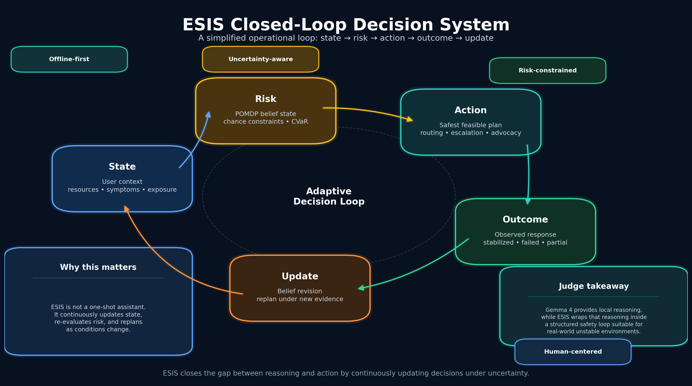
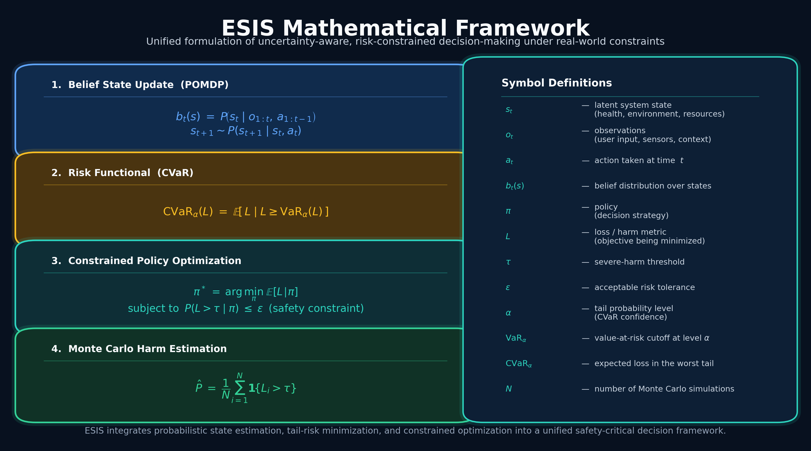

# ESIS — Edge Survival Intelligence System


**Offline-first crisis navigation for people experiencing homelessness, powered by Gemma 4.**

---

## What It Does

ESIS converts fragmented, high-risk crisis situations into structured intervention pathways. It takes a person's current state — symptoms, exposure conditions, document status, available resources — and uses Gemma 4 to generate an immediate action plan, an advocacy packet, and an explainable audit trail.

The system is designed to work **offline, on low-end devices, under extreme constraint** — because that is where people actually need it.

---

## Why It Matters

> *"If someone with deep technical expertise and decades of experience cannot recover within the current system, then the system itself is fundamentally broken."*

Human-managed systems for allocating aid and housing are inconsistent, biased, and prone to critical error. ESIS addresses this as a **decision-making problem**, not just a resource problem.

Three failure modes kill people every year:

| Failure Mode | What Happens | ESIS Response |
|---|---|---|
| Post-discharge instability | Hospital discharges to street with active infection | Advocacy packet + escalation pathway |
| Exposure risk | Freezing night, low battery, no shelter found | Offline routing + battery-aware fallback |
| Administrative collapse | Lost ID, broken referral chain, missed contacts | Document recovery sequence + packet |

---

## System Architecture


ESIS operates as a closed-loop decision system:

**State → Risk → Action → Outcome → Update**

- **Intake layer** — normalizes fragmented input into a structured case
- **Triage layer** — scores medical, exposure, and documentation risk deterministically
- **Gemma 4 reasoning** — generates structured JSON: summary, 3 actions, fallback, what to preserve
- **Routing layer** — selects the safest feasible pathway under active constraints
- **Packet layer** — produces a referral-ready advocacy packet
- **Audit layer** — explains why this route was chosen and which risk flags triggered



---

## Mathematical Framework

ESIS uses chance-constrained optimization and CVaR risk control:

- **Belief state**: `b_t(s) = P(s_t | o_{1:t}, a_{1:t-1})` — partial observability over crisis state
- **Risk constraint**: `P(Harm_72h > τ) ≤ ε` — reject plans above harm threshold
- **CVaR**: minimize expected loss in the worst tail, not average-case outcomes



---

## Demo Scenarios

Four gold-standard cases covering the core failure modes:

| Case | Description | Key Risk |
|---|---|---|
| `case_post_discharge.json` | Discharged with spinal infection, no shelter | Medical 90%+ |
| `case_cold_night.json` | Below freezing, 9% battery, can't reach 211 | Exposure 85%+ |
| `case_lost_documents.json` | Lost ID, broken referral chain, two-week silence | Documents 60%+ |
| `case_mixed_failure.json` | All three failure modes simultaneously | All high |

---

## Quickstart

```bash
git clone https://github.com/YOUR_USERNAME/esis.git
cd esis
pip install -r requirements.txt
streamlit run app/ui/streamlit_app.py
```

For the Streamlit app to use Gemma 4 live inference, set `HF_TOKEN` in your environment:

```bash
export HF_TOKEN=your_huggingface_token
```

Without a token, the app uses the deterministic fallback engine (still fully functional for demos).

---

## Run Tests

```bash
pytest tests/ -v
```

---

## Links

- **Live Demo (HuggingFace Spaces):** *(link added after deployment)*
- **Kaggle Notebook (Gemma 4 demo):** *(link added after notebook publication)*
- **Kaggle Competition:** https://www.kaggle.com/competitions/gemma-4-good-hackathon

---

## Evaluation


| Metric | Traditional Workflow | ESIS |
|---|---|---|
| Time to safety | 24–72+ hours | Minutes–hours |
| Housing pathway start | Months–years | Same day–72 hrs |
| Decision consistency | Low / variable | Structured / repeatable |
| Offline usability | Fragmented | Native |

---

## Limitations

- Gemma 4 structured output may require retry on malformed JSON (deterministic fallback always available)
- Resource data (shelter locations, contacts) requires periodic offline pack updates
- The system supports decision-making — it does not replace human advocates or clinical judgment
- V1 triage scoring is deterministic rules-based; a trained probabilistic model would improve calibration

---

## Future Work

- Fine-tuned Gemma 4 adapter on homelessness intervention case data
- Offline vector index (FAISS) for local resource retrieval
- Mobile PWA with GPS-aware routing
- Integration with coordinated entry / HMIS systems
- Multi-language support

---

*Submission for the Gemma 4 Good Hackathon — Google/Kaggle, 2026.*
*Built with lived experience. The problem being solved here is real.*
